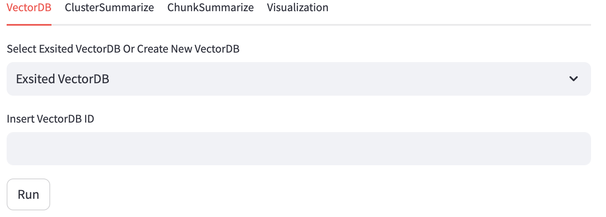
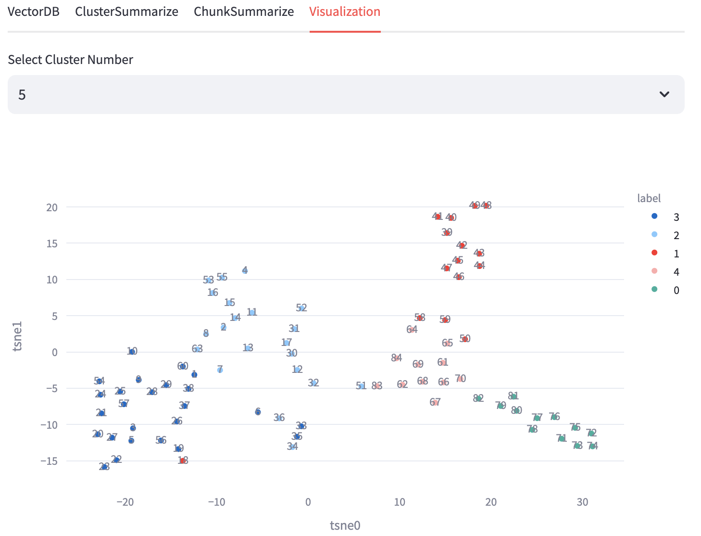
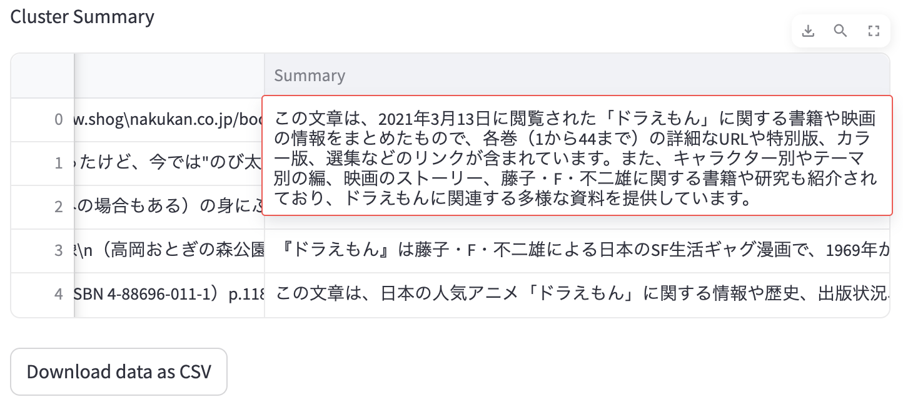
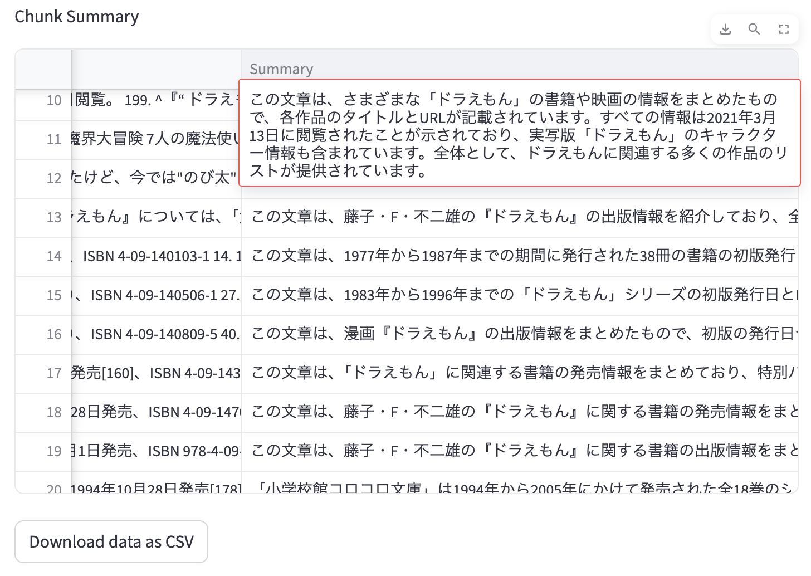

# Create a vectorstore chunk visualization app with DataRobot

**Author:** senkin.zhan@datarobot.com

**Demo data:** https://s3.us-east-1.amazonaws.com/datarobot_public_datasets/ai_accelerators/DORAEMON.zip

## Problem framing

This AI Accelerator demonstrates how to implement a Streamlit application to gain insights from a vector database of chunks. A RAG developer can compare similarity between chunks and remove unnecessary data during RAG development.

## Accelerator overview

The following steps outline the accelerator workflow. If you experience network or Azure API errors while running the Streamlit application, refresh the browser and run the application again.

1. In the DataRobot application, navigate to **NextGen > Registry > Applications**.
2. Build a Streamlit application.

 

3. Upload the document to build a vectorstore with DataRobot or use exsiting vectorstore.

4. Build a summary of clusters with Azure OpenAI services.

5. Build a summary of chunks with Azure OpenAI service.

6. Select how many clusters to chunk.

7. View the summaries of clusters and chunks for analysis.

